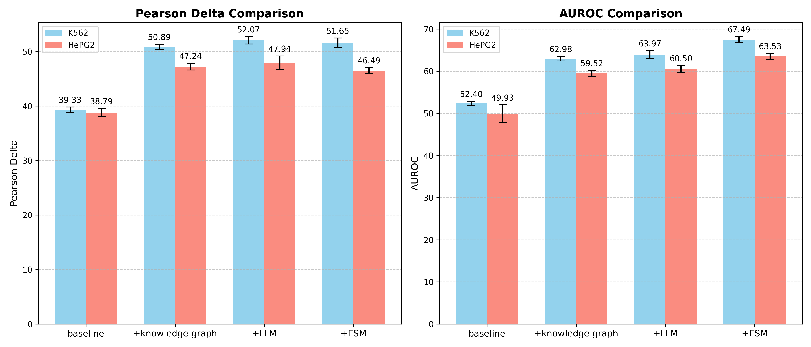

# PoC Model - Data-Driven Perturbation Prediction

This directory contains a proof-of-concept validation on various perturbation embeddings for data-driven perturbation prediction models.

## Overview

The project implements various model architectures to generate different perturbation embeddings and shows the enhancements to predict cellular responses to genetic perturbations.

## Results

The following plot shows performance comparisons across different model configurations on K562 and HePG2 cell lines:



The plot compares:
- **Pearson Delta**: Correlation-based metric for prediction accuracy
- **AUROC**: Area Under the Receiver Operating Characteristic curve

Model configurations evaluated:
- **baseline**: Base model
- **+knowledge graph**: Baseline + knowledge graph integration
- **+LLM**: Baseline + Large Language Model features
- **+ESM**: Baseline + ESM (Evolutionary Scale Modeling) protein embeddings

## Project Structure

- `main.py` - Main training script using Hydra for configuration management
- `make_plot.py` - Script to generate performance comparison plots
- `calculate_DEGs.py` - Utility for calculating differentially expressed genes (DEGs)
- `configs/` - Configuration files for different model setups
- `gspp/` - Core model implementations and data modules
- `data/` - Data files including gene sets and graph structures
- `*.ipynb` - Jupyter notebooks for evaluation and data exploration

## Usage

### Training

Training can be performed using the main script with Hydra configuration:

```bash
python main.py
```

Configuration files are located in the `configs/` directory.

### Generating Plots

To regenerate the performance comparison plot:

```bash
python make_plot.py
```

This will generate `plot.png` with the performance metrics.

### Calculating DEGs

To calculate differentially expressed genes:

```bash
python calculate_DEGs.py --dataset_name K562_single_cell_line --method true_degs
```

## Dependencies

See `pyproject.toml` for a complete list of dependencies. Key dependencies include:
- PyTorch
- PyTorch Lightning
- PyTorch Geometric
- Hydra (for configuration management)
- Scanpy
- NumPy, Pandas
- Matplotlib


## Notes

This is a proof-of-concept implementation for exploring different approaches to perturbation prediction. The code serves as a research prototype for evaluating various modeling strategies and their impact on prediction performance.

