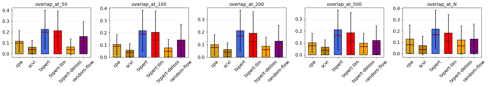
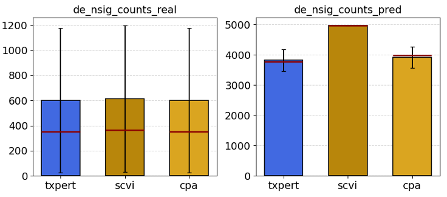
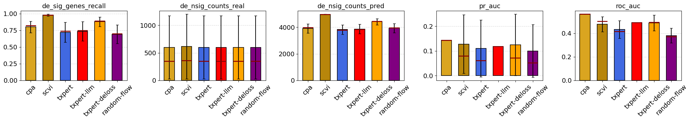

# Baseline Models for Perturbation Prediction

This directory contains implementations and evaluation scripts for baseline models used to predict cellular perturbation effects on gene expression. These baselines serve as comparison points for evaluating advanced perturbation prediction models.

## Overview

The baselines include both simple heuristic methods and established state-of-the-art models for single-cell perturbation prediction:

- **LowRankLinear (LRM)**: Low-rank matrix factorization approach
- **CPA**: Compositional Perturbation Autoencoder
- **scGPT**: Single-cell GPT model (supports both genetic and chemical perturbations)
- **scVI**: Single-cell Variational Inference
- **GEARS**: Gene Expression Analysis via Random Subsets (supports genetic and chemical perturbations)
- **Simple baselines**: CellTypeMean, SimpleSum, EmbedSum, etc.

## Installation

Install the required dependencies:

```bash
pip install -r requirements.txt
```

## Usage

### Training Models

Use the training script to train a baseline model:

```bash
bash scripts/train.sh <MODEL_NAME> <DATASET_NAME> <FOLD_ID>
```

**Examples:**

```bash
# Train CPA on Replogle fold 1
bash scripts/train.sh cpa replogle 1

# Train scVI on Tahoe generalization split
bash scripts/train.sh scvi tahoe -1

# Train LowRankLinear with custom embeddings
bash scripts/train.sh lrlm replogle -1 <pert_emb>
```

**Available models:**
- `cpa`: Compositional Perturbation Autoencoder
- `scvi`: Single-cell Variational Inference
- `scgpt`: Single-cell GPT (automatically selects genetic/chemical variant)
- `gears`: GEARS model (automatically selects genetic/chemical variant)
- `lrlm`: Low-rank Linear Model
- `celltypemean`: Cell type mean baseline
- `simplesum`: Simple sum baseline

### Generating Predictions

After training, generate predictions using the prediction script:

```bash
bash scripts/predict.sh <MODEL_NAME> <DATASET_NAME> <FOLD_ID> [CHECKPOINT]
```

**Examples:**

```bash
# Generate predictions with default checkpoint
bash scripts/predict.sh cpa replogle 1

# Generate predictions with specific checkpoint
bash scripts/predict.sh scvi tahoe -1 final.ckpt
```

## Evaluation Results

The baseline models are evaluated using comprehensive metrics including:

- **Overlap metrics**: `overlap_at_50`, `overlap_at_100`, `overlap_at_200`, `overlap_at_500`, `overlap_at_N`
- **Precision metrics**: `precision_at_50`, `precision_at_100`, `precision_at_200`, `precision_at_500`, `precision_at_N`
- **Differential expression metrics**: `de_sig_genes_recall`, `de_nsig_counts_real`, `de_nsig_counts_pred`
- **Classification metrics**: `roc_auc`, `pr_auc`
- **Direction and correlation**: `de_direction_match`, `de_spearman_sig`, `de_spearman_lfc_sig`
- **Distance metrics**: `pearson_delta`, `mse_delta`, `mae_delta`, `mse`, `mae`

### Visualization of Results

Evaluation results are visualized in the following plots:

#### Overlap Recall Metrics



This plot shows the overlap metrics (overlap_at_50, overlap_at_100, overlap_at_200, overlap_at_500, overlap_at_N) across different baseline models. Overlap metrics measure the proportion of top-ranked predicted genes that overlap with experimentally validated differentially expressed genes.

#### Overlap Counts



This visualization shows the counts of overlapping genes between predicted and real differentially expressed genes at different thresholds, providing insight into the absolute number of correctly predicted genes.

#### Additional Evaluation Metrics



This comprehensive plot includes additional evaluation metrics such as:
- Recall of significant differentially expressed genes (`de_sig_genes_recall`)
- Counts of real vs predicted significant genes (`de_nsig_counts_real`, `de_nsig_counts_pred`)
- ROC AUC and PR AUC scores (`roc_auc`, `pr_auc`)

These plots compare performance across multiple baseline models including:
- **CPA** (yellow/gold)
- **scVI** (dark goldenrod)
- **txpert** (royal blue) - if included in evaluation
- **txpert-llm** (red) - if included in evaluation
- **txpert-deloss** (orange) - if included in evaluation
- **random-flow** (purple) - if included in evaluation

## Directory Structure

```
baselines/
├── README.md                    # This file
├── requirements.txt             # Python dependencies
├── plot.ipynb                   # Jupyter notebook for generating evaluation plots
├── dataset.ipynb                # Dataset loading and preprocessing notebook
├── overlap_recall.png           # Overlap recall metrics visualization
├── overlap_counts.png           # Overlap counts visualization
├── more_results.png             # Additional evaluation metrics visualization
├── scripts/
│   ├── train.sh                 # Training script
│   └── predict.sh               # Prediction script
└── state_sets_reproduce/        # Main implementation code
    ├── models/                  # Model implementations
    │   ├── cpa/                 # CPA model
    │   ├── scvi/                # scVI model
    │   ├── scgpt/               # scGPT model
    │   ├── gears/               # GEARS model
    │   ├── low_rank_linear.py   # LowRankLinear model
    │   └── ...
    ├── configs/                 # Configuration files
    │   ├── model/               # Model-specific configs
    │   ├── data/                # Dataset configs
    │   ├── splits/              # Train/test split configs
    │   └── training/            # Training configs
    └── train/                   # Training and evaluation code
```

## Model Details

### LowRankLinear (LRM)

A low-rank matrix factorization approach that learns separate embeddings for genes and perturbations, then uses a low-rank linear transformation to predict perturbation effects.

**Key features:**
- Supports multiple gene embedding strategies (scGPT, etc.)
- Supports multiple perturbation embedding strategies (identity, RDKit, etc.)
- Efficient training with large batch sizes

### CPA (Compositional Perturbation Autoencoder)

A variational autoencoder-based approach that learns a compositional representation of perturbations.

**References:**
- Lotfollahi et al., "Predicting cellular responses to complex perturbations in high-throughput screens" (Molecular Systems Biology, 2023)

### scVI (Single-cell Variational Inference)

A probabilistic model for single-cell RNA-seq data that can be adapted for perturbation prediction.

**References:**
- Lopez et al., "Deep generative modeling for single-cell transcriptomics" (Nature Methods, 2018)

### scGPT

A transformer-based model pre-trained on large-scale single-cell data and fine-tuned for perturbation prediction.

**Features:**
- Supports both genetic perturbations (scGPT-genetic) and chemical perturbations (scGPT-chemical)
- Gene tokenization and encoding
- Domain-specific batch normalization

### GEARS

A graph neural network-based model that leverages gene-gene interaction networks for perturbation prediction.

**Features:**
- Supports both genetic perturbations (GEARS) and chemical perturbations (GEARS-chemical)
- Uses gene-gene co-expression networks and Gene Ontology annotations

## Configuration

Model and training configurations are stored in `state_sets_reproduce/configs/`. Key configuration files:

- **Model configs**: `configs/model/*.yaml` - Define model architectures and hyperparameters
- **Data configs**: `configs/data/*.yaml` - Define dataset loading parameters
- **Split configs**: `configs/splits/*.toml` - Define train/validation/test splits
- **Training configs**: `configs/training/*.yaml` - Define training schedules and optimization

## Reproducing Results

To reproduce the evaluation results shown in the PNG files:

1. Train models on your dataset of choice:
   ```bash
   bash scripts/train.sh <model> <dataset> <fold>
   ```

2. Generate predictions:
   ```bash
   bash scripts/predict.sh <model> <dataset> <fold>
   ```

3. Use the `plot.ipynb` notebook to aggregate results and generate visualizations:
   - Load aggregated results from each model's output directory
   - Combine results into a single DataFrame
   - Use the plotting functions to generate comparison plots


## Citation

If you use these baseline implementations, please cite the original papers:

- **CPA**: Lotfollahi et al., Molecular Systems Biology (2023)
- **scVI**: Lopez et al., Nature Methods (2018)
- **scGPT**: Cui et al., bioRxiv (2023)
- **GEARS**: Roohani et al., bioRxiv (2022)

